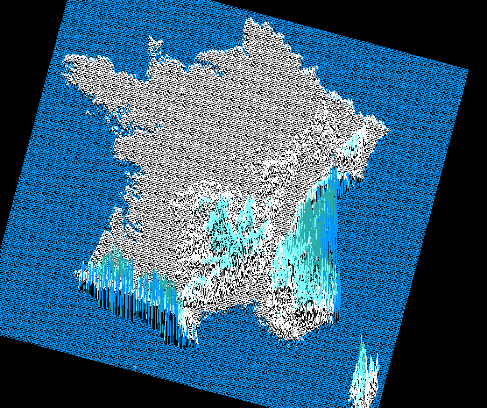
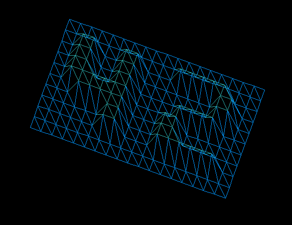
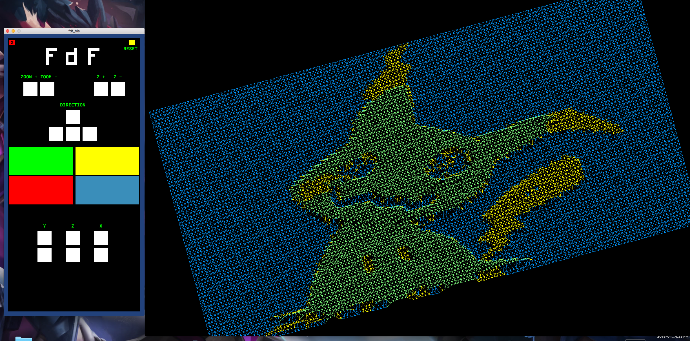

# fdf
## fil de fer

Date du projet : 2017/05/20

Premier projet de la branche graphique qui introduit les libraires graphiques et au parsing de bases.

## Bases du projet : 
Afficher un rendu en semi 3d d'un fichier donner sous forme de caractères numérique.

## Option bonus :
Interface utlisateur, lecture de code hexadecimal present dans le fichier source, 
taille de la map reglable, changement de couleur, reset, profondeur reglable, rotation de la map.

